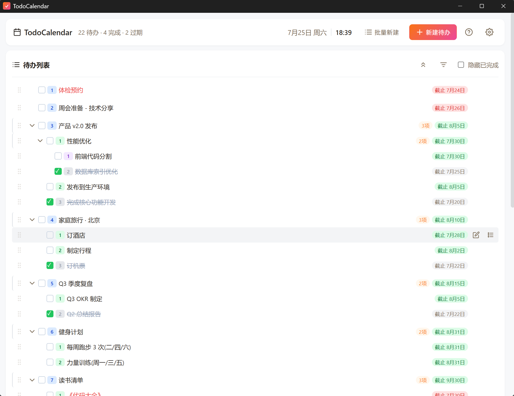
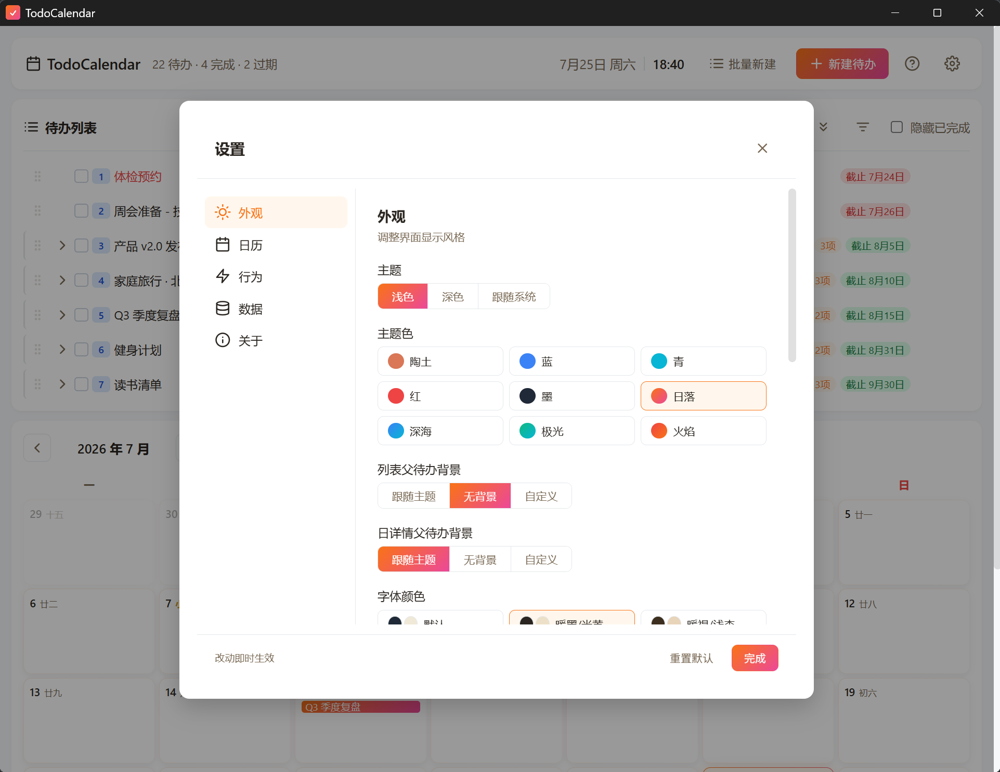
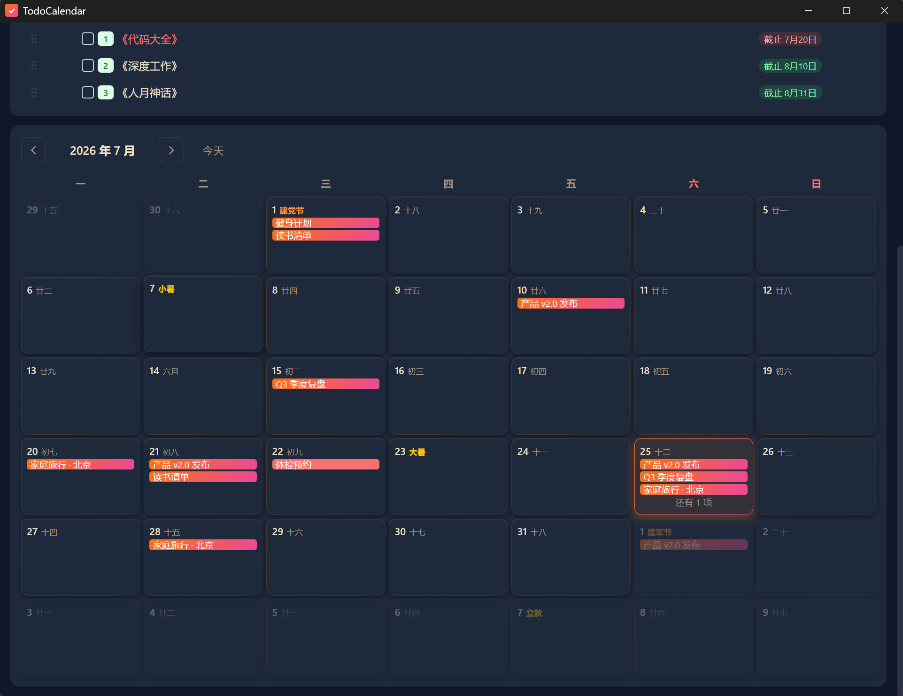

# TodoCalendar

> 极简待办日历 — 本地优先,仅专注于待办
>
> A minimalist local-first desktop calendar + todo app.

<p align="center">
  
</p>

## 核心功能

### 📅 日历

- 月视图,可选农历 / 周数
- 点击日期查看当日详情
- 跨日任务可视化(开始 / 进行中 / 截止)
- 当天截止高亮警示

<p align="center"></p>

### ✅ 待办

- 无限嵌套子任务
- 拖拽排序 / 自动按截止时间
- 批量创建(粘贴缩进文本)
- 自定义分组(Default + 自定义)
- 时间精度切换(日期 / 具体时间)
- 编号样式(WBS / 简单)

<p align="center"></p>

### 🎨 个性化

- 浅 / 深 / 跟随系统 三种主题
- 9 种主题色(纯色 + 渐变)
- 字体大小(小 / 中 / 较大 / 大)
- 字体颜色偏好(默认 + 3 暖色预设)
- 紧凑模式

<p align="center"></p>

### 🌙 深色模式

<p align="center"></p>

### 📦 归档

- 完成后自动归档(可配置天数)
- 历史记录按树形展示
- 时间范围批量删除(二次确认)
- 一键恢复

## 下载

前往 [Releases](../../releases) 下载 Windows 安装包(NSIS `.exe`)。

支持 Windows 10 / 11。

## 隐私

所有数据存于本地,无网络请求,无账号,无遥测。

- Windows: `%APPDATA%\com.todocalendar.app\`
  - `todos.json` — 待办与分组
  - `settings.json` — 偏好设置

支持 JSON 导出 / 导入,数据完全可迁移。

## 开发

依赖:[Node.js](https://nodejs.org/) 18+、[Rust](https://www.rust-lang.org/tools/install) stable、Windows SDK。

```bash
# 启动开发模式
npx --yes @tauri-apps/cli@latest dev

# 构建 release 安装包
npx --yes @tauri-apps/cli@latest build
# 输出: src-tauri/target/release/bundle/
```

## 反馈

[新建 Issue](../../issues/new) 报 Bug 或提建议。

## License

[MIT](LICENSE)
